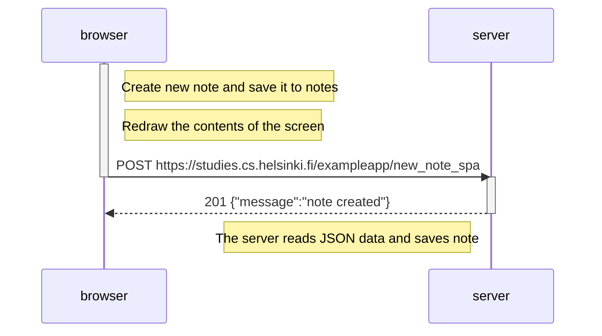

0.5: SPA new note diagram:

```mermaid
sequenceDiagram
    participant browser
    participant server
    
    activate browser
    Note right of browser: Create new note and save it to notes
    Note right of browser: Redraw the contents of the screen
    browser->>server: POST https://studies.cs.helsinki.fi/exampleapp/new_note_spa
    deactivate browser
    activate server
    server-->>browser: 201 {"message":"note created"}
    deactivate server
    Note left of server: The server reads JSON data and saves note
```
